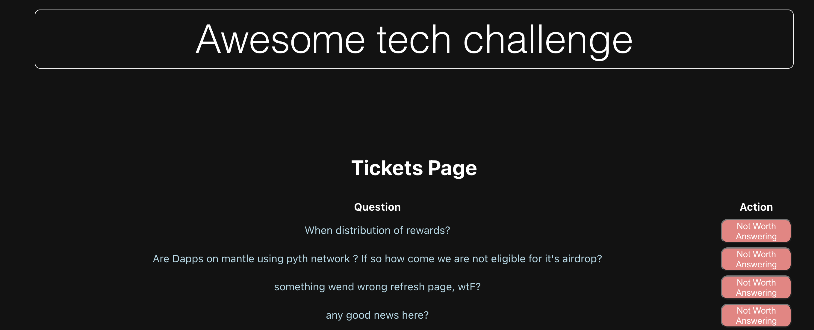
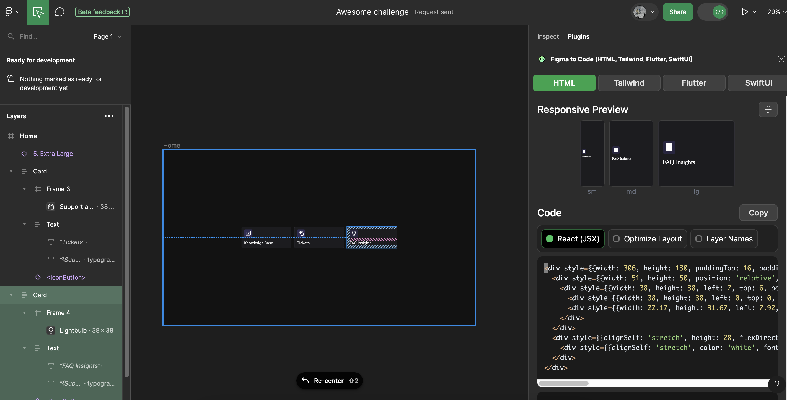

# Awesome ticket challenge

### Backend

Steps to setup the backend environment:

1. [Download the ticket data here](https://drive.google.com/file/d/1Bvk2mW5t3GfkqTkpURiFpaLuqrUckzUX/view?usp=sharing)
2. Place it in data/awesome_tickets.json
3. Run `make setup`
4. Run `make run`
5. Try it by calling [http://localhost:5001/tickets](http://localhost:5001/tickets)

### Frontend

1. Run `make setup`
2. Run `make run`
3. Open it: [http://localhost:3002](http://localhost:3002)

### Happy coding 🎉

* * *
# Awesome ticket challenge Outcome



## Tasks 

The following tasks were completed as a part of the Awesome ticket challenge, as described [here](https://awesome-qa.notion.site/Awesome-Ticket-Challenge-e920f17870ca459085056539ee188824).

- [x] [Task 1](#task-1): Display a list of questions associated with un-answered ticket items .
- [x] [Task 2](#task-2): Embed the link to the original question posted on the relevant Discord server.
- [x] [Task 3](#task-3): Add functionality to remove tickets that are not worth answering without persistent effect.
- [x] [Task 4](#task-4): On the home page add three buttons in the same style as displayed in [Figma](https://www.figma.com/file/eYKjI66zcCp4KyG2kE4yTO/Awesome-challenge?node-id=0%3A1&mode=dev). Also enable access to the list of questions via the "Tickets" button.

## Conda environment used
 
All the relevant backend Python dependencies are logged in the `requirements.yml` file. The environment can be recreated using the following command:  
```
conda env create --file requirements.yml
```

## Data
```
./data/awesome_tickets.json
        ├── tickets
        │   ├── id
        │   ├── msg_id
        │   ├── status
        │   ├── resolved_by
        │   ├── ts_last_status_change
        │   ├── timestamp
        │   └── context_messages
        │ 
        └──messages
            ├── id
            ├── channel_id
            ├── parent_channel_id
            ├── community_server_id
            ├── timestamp
            ├── has_attachment
            ├── reference_msg_id
            ├── timestamp_insert
            ├── discussion_id
            ├── author_id
            ├── content
            ├── msg_url
            └── author
                ├──  id
                ├── name
                ├── nickname
                ├── color
                ├── discriminator
                ├── avatar_url
                ├── is_bot
                └── timestamp_insert      
```
Above is a diagrammatic representation of the various key-value pairs present in individual dictionary elements under the "tickets" and "messages" list respectively.


## Process
### Task 1
* Files modified:
    *   `./backend/app/main.py`
    *   `./frontend/pages/tickets.tsx`
* Since our backend runs on `localhost:5001` and the frontend runs on `localhost:3000` cross-origin requests had to be enabled that are disabled by default. This was done by setting up **Cross-Origin Resource Sharing (CORS)** in the FastAPI backend.The following changes were made to `./backend/app/main.py` file.
    *   Import "CORSMiddleware" : `from fastapi.middleware.cors import CORSMiddleware`
    *   Replace "origins" with frontend url.
        ```
            origins = ["http://localhost:3000"]

            app.add_middleware(
            CORSMiddleware,
            allow_origins=origins,
            allow_credentials=True,
            allow_methods=["*"],
            allow_headers=["*"],
            )
        ```   
    *   Return "content" by matching the relevant ticket "msg_id" against the message "id". The results are presented on the endpoint `http://localhost:5001/ticket-ids`.  

The following changes were made to `./frontend/pages/tickets.tsx`, which is accessible via `./frontend/pages/home/index.tsx`.
    *   Use React hooks to initialize state variables to store ticekt information.
        ```
            const [ticketData, setTicketData] = useState<{
            contents: string[];
            }>({
            contents: [],
            });

        ```
    *   Fetch ticket data by making asynchronous request to the backend endpoint. 
    *   Render the content that is retrieved.
        ```
                    return (
            <div style={{ textAlign: "center", marginTop: "20vh" }}>
                <h1>Tickets Page</h1>
                {/* Display the fetched content in a table */}
                <table style={{ margin: "0 auto" }}>
                {/* ... */}
                </table>
            </div>
            );
        ```

### Task 2
* Files modified:
    *   `./backend/app/main.py`
    *   `./frontend/pages/tickets.tsx`
* In `./backend/app/main.py` the function `get_ticket_ids_with_urls()` is defined againt the endpoint `http://localhost:5001/ticket-ids`.
* In `./frontend/pages/tickets.tsx` data is fetched asynchronously as follows.
    ```
          const fetchTicketData = async () => {
            try {
            const response = await fetch("http://localhost:5001/ticket-ids");
            const data = await response.json();
            setTicketData({
                ids: data.map((item: { id: string; content: string; msg_url: string }) => item.id),
                contents: data.map((item: { id: string; content: string; msg_url: string }) => item.content),
                msgUrls: data.map((item: { id: string; content: string; msg_url: string }) => item.msg_url),
            
            });
            } catch (error) {
            console.error("Error fetching ticket data:", error);
            }
  };
    ```
* The links defined in "msg_url" are embedded in the "content" text as follows.
    ```
            <a
            href={ticketData.msgUrls[index]}
            target="_blank"
            rel="noopener noreferrer"
            style={{
            color: clickedLinks.has(index) ? "lilac" : "lightblue",
            textDecoration: "none",
            }}
            onClick={() => handleLinkClick(index)}
            >
            {ticketData.contents[index]}
            </a>
    ```
* The function `handleLinkClick()` takes in the index associated with the ticket. Another set called `updatedClickLinks` is created to keep a track of clicked links, while the state variable `clickedLinks` is updated with the state `updatedClickedLinks` to re-render the React component.

### Task 3
* Files modified:
    *   `./backend/app/main.py`
    *   `./frontend/pages/tickets.tsx`
* In `./backend/pages/main.py` a `flagged_ticket` set is created to keep track of flagged ticket ids. In addition the `flag_ticket()` function is implemented with `http://localhost:5001/flag-ticket/{ticket_id}` endpoint.
    ```
        @app.post("/flag-ticket/{ticket_id}")
        async def flag_ticket(ticket_id: str):
            flagged_tickets.add(ticket_id)
            return {"message": f"Ticket {ticket_id} flagged as not worth answering."}
    ```

* In addition, only the unflagged tickets are displayed on the `http://localhost:5001/ticket-ids` endpoint.
    ```
        @app.get("/ticket-ids")
        async def get_ticket_ids_with_urls(
            limit: int = 20,
            ticket_repository: TicketRepository = Depends(lambda: ticket_repository),
        ):
            ...
            
            # Exclude flagged tickets
            valid_tickets = [ticket for ticket in tickets if ticket["id"] not in flagged_tickets]

            ...
    ```

* In `./frontend/pages/tickets.tsx` a clickable event is used to handle the "Not worth Answering" response.
    ```
        <button
            style={{
            backgroundColor: "lightcoral",
            color: "white",
            borderRadius: "10px",
            }}
            onClick={() => handleFlagTicket(ticketId)}
        >
            Not Worth Answering
        </button>
    
    ```
* A `POST` request is made to the backend in-order to flag the ticket_id associated with the clicked event. 

    ```
        const handleFlagTicket = async (ticketId: string) => {
            try {
            await fetch(`http://localhost:5001/flag-ticket/${ticketId}`, {
                method: "POST",
            });

            // After flagging the ticket, refresh the ticket data excluding flagged tickets
            fetchTicketData();
            } catch (error) {
            console.error(`Error flagging ticket ${ticketId}:`, error);
            }
        };
    
    ```

### Task 4
* Files modified:
    *   `./frontend/pages/home/index.tsx`
    *   `./frontend/public/faq-icon.svg`
    *   `./frontend/public/knowledge-icon.svg`
    *   `./frontend/public/tickets-button.svg`

*  In `./frontend/pages/home/index.tsx` all the aforementioned svg files are referenced and placed in a div that center aligns all the buttons. The "tickets-button" file is embedded in a Link to the "tickets.tsx" page.
    ```
        <Link href="/tickets" passHref>
                    <Button > 
                       ...
                    </Button>
                </Link>
    ```
* Do access constraints on the [Figma platform](https://www.figma.com/file/eYKjI66zcCp4KyG2kE4yTO/Awesome-challenge?node-id=0%3A1&mode=dev) the accessible React(JSX) code was used to obtain the relevant svg file. As a consequence of this approach I wasn unable to incorporate the code associated with #lightbulb, #librarybooks, and #supportagent sub-components.

